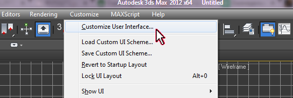
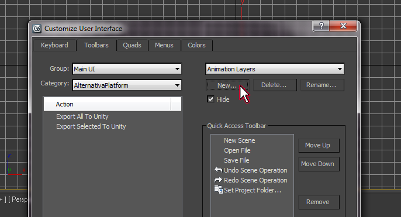
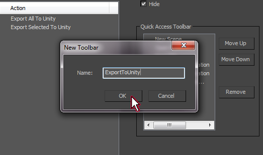
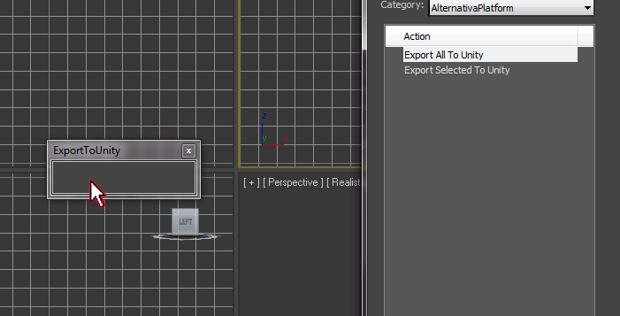
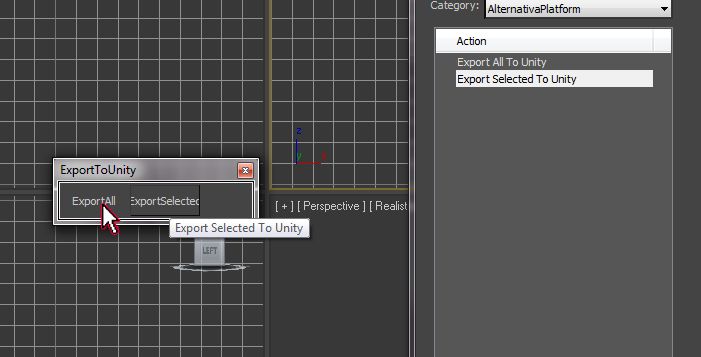
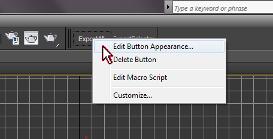
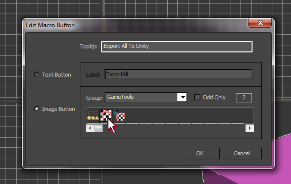
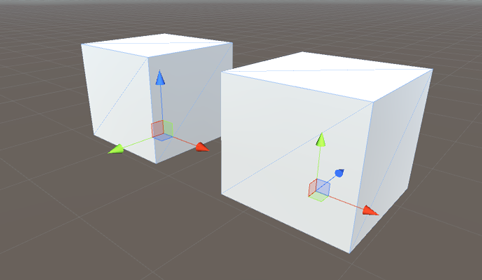

### Описание ###
Скрипт предназначен для подготовки моделей для экспорта в Unity. Скрипт перед экспортом меняет оси координат чтобы ось Y была направлена вверх (ось будет Z направлена противоположно изначальной оси Y).

Поддерживаются анимации, иерархии объектов, скелетная анимация (модификатор Skin).

### Установка ###

Скопировать скрипт в папку

> C:\Program Files\Autodesk\3ds Max 2012\Scripts\Startup\ExportToUnity.ms

Добавить кнопки вызова экспорта на панель инструментов:

Открыть настройки "Customize User Interface..."

На вкладке Toolbars создать новую панель инструментов "ExportToUnity"

Из категории "AlternativaPlatform" перетащить элементы экспорта в новую панель инструментов

Закрыть окно настройки интерфейса. Переместить панель в главную панель инструментов.

Можно также настроить отображаемое название кнопок либо задать иконку

Например использовать иконки из вкладки "GameTools"

В дальнейшем для экспорта использовать эти кнопки.

### Установка последней версии FBX плагина ###

Необходимо использовать самую новую версию FBX плагина.

Скачать можно с этого пути:
[http://usa.autodesk.com/adsk/servlet/pc/item?siteID=123112&id=22694994](http://usa.autodesk.com/adsk/servlet/pc/item?siteID=123112&id=22694994)

### Правила подготовки контента ###

Для скелетной анимации Bind pose (Initial Pose) должен быть настроен в нулевом кадре анимации. При подготовки происходит перепривязка скина и сбрасывается трансформация Bind Pose в нулевом кадре.

Могут быть проблемы при экспорте скейла, если скейл для разных осей не идентичен.

Оси меняются следующим образом:

> Направление оси X сохраняется
> 
> Направление оси Y становится таким же как было направление оси Z
>
> Направление оси Z противоположно изначальному направлению оси Y
